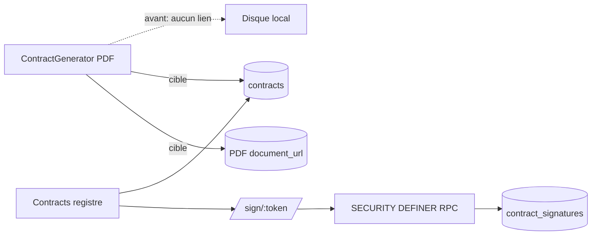

# Audit — Module Contrats (My Butlr)

**Date :** 2026-07-13  
**Périmètre :** registre `/app/contracts`, générateur `/app/contracts/generate`, signature publique `/sign/:token`, schémas & RLS associés  
**Verdict :** fonctionnel en prototype, **pas encore un flux contrat de production** — le PDF et la signature restent déconnectés.

---

## 1. Architecture actuelle

Deux produits juxtaposés, sans boucle fermée :

| Surface | Rôle | Persistance |
|---|---|---|
| `Contracts.tsx` | Registre CRUD (métadonnées + statut + lien de signature) | Table `contracts` |
| `ContractGenerator.tsx` | Wizard FR location saisonnière + PDF jsPDF | Téléchargement local uniquement (avant correctifs) |
| `ContractSigning.tsx` | Signature anonyme par token | RPC `get/sign_contract_by_token` + `contract_signatures` |

Le générateur de factures (`InvoiceGenerator`) enregistre déjà en base. Le générateur de contrats ne le faisait pas → le signataire ne pouvait presque jamais ouvrir le document (`document_url` souvent null).

---

## 2. Points forts

- Wizard clair (Modèle → Parties → Séjour → Articles → Aperçu) + modèles sauvegardables.
- Gabarit juridique FR riche (15 articles, bailleur SAS EBSCOPAL, intermédiaire, cases Loyer / Dépôt / Check-in).
- Sécurité token corrigée (phase 7.1) : plus d’énumération publique via RLS permissives.
- RBAC UI via `useRoleFilter` / `canEdit('contracts')`.
- Export CSV, pagination, parcours mobile/desktop.

---

## 3. Failles & dettes (par sévérité)

### Critique

1. **PDF non relié au registre / à la signature**  
   Le PDF était généré côté client sans `INSERT` ni upload Storage. La page de signature n’affiche que guest / property / type / date — pas les clauses.

2. **« Send for signature » n’envoie rien**  
   Crée un token + notification interne owner, **aucun e-mail / SMS**. Le modal lien n’était pas ouvert après envoi → le lien restait souvent invisible.

3. **Schéma incohérent**  
   - UI + TypeScript : `archived`  
   - `schema.sql` CHECK : `('draft','sent','signed','expired')` sans `archived`  
   - `signing_token` absent du CREATE TABLE de `schema.sql` (présent seulement en migration)

### Haute

4. **Signature sans snapshot immuable**  
   Seule l’image de signature est stockée. Pas de hash du PDF signé, pas de version figée des articles — faible valeur probatoire.

5. **RLS trop permissive** (cf. `supabase/rls-audit.md`)  
   Tout utilisateur authentifié peut lire/écrire tous les contrats / templates.

6. **Articles PDF hardcodés par numéro** (`art.number === 2|3|4|10`)  
   Renommer / réordonner casse les encadrés spéciaux.

### Moyenne

7. **`updateTemplate` existant mais inutilisé** — chaque « Sauvegarder » crée un duplicata.
8. **Drag handle (`GripVertical`) sans drag-and-drop** — UX trompeuse.
9. **Texte FR sans accents** dans le gabarit (`present` vs `présent`) — rendu PDF ASCII.
10. **Pas de lien UI** liste → générateur (sidebar OK, page Contrats non).
11. **Statut `expired`** sans job / règle de passage automatique.
12. **E2E** `e2e/contracts.spec.ts` : smoke très faible (pas de parcours PDF ni signature).

### Basse

13. Bailleur / villa hardcodés « The French Way » — OK marque, mais multi-propriété nécessite presets par bien.
14. Locale mixte EN (Contracts, Signing) / FR (Generator).
15. `handleLoadTemplate` ne resynchronise pas `stay` avec `propertyDefaults` du modèle chargé.

---

## 4. Correctifs livrés dans cette PR

| Correctif | Fichiers |
|---|---|
| Audit documenté | `docs/audit-contrats.md` |
| Schéma : `archived` + `signing_token` | `schema.sql` + migration `phase7_3` |
| Générateur : PDF → Storage + ligne `contracts` + lien réservation | `ContractGenerator.tsx` |
| Mise à jour d’un modèle existant (vs toujours créer) | `ContractGenerator.tsx` |
| CTA « Générer » depuis la liste + ouverture du lien après envoi | `Contracts.tsx` |
| Message clair si document manquant à la signature | `ContractSigning.tsx` |

---

## 5. Roadmap recommandée

### P0 — Boucle produit

- [x] Persister le contrat généré + `document_url`
- [ ] Edge Function e-mail (Resend / Supabase) avec lien `/sign/:token`
- [ ] Snapshot PDF post-signature (ré-embed signature + hash SHA-256)
- [ ] Sync `reservations.contract_status` à l’envoi / signature

### P1 — Robustesse juridique & data

- [ ] Remplacer les `if (art.number === N)` par `article.kind` (`stay|payment|deposit|checkinout|generic`)
- [ ] Versionner le template (`template_version`) figé sur le contrat signé
- [ ] Accents FR + revue juridique (CGU location saisonnière, mentions Code du tourisme)
- [ ] Expiration token (`signing_expires_at`) + révocation
- [ ] Appliquer `rls-production-policies.sql` pour `contracts` / `contract_templates`

### P2 — UX

- [ ] True drag-and-drop des articles (dnd-kit)
- [ ] Pré-remplir depuis fiche propriété (surface, chambres, services inclus)
- [ ] Unifier i18n FR/EN
- [ ] Aperçu PDF inline (blob URL) avant téléchargement
- [ ] E2E : generate → list → sign → status `signed`

---

## 6. Matrice de maturité

| Capacité | Avant | Après cette PR | Cible prod |
|---|---|---|---|
| Générer PDF FR | ✅ | ✅ | ✅ |
| Enregistrer contrat | ❌ | ✅ | ✅ |
| Document consultable par le signataire | ❌ | ✅ | ✅ |
| E-signature token sécurisé | ✅ (7.1) | ✅ | ✅ |
| Envoi e-mail réel | ❌ | ❌ | ✅ |
| Preuve PDF signé | ❌ | ❌ | ✅ |
| RLS multi-tenant | ❌ | ❌ | ✅ |

**Score global avant : ~4/10** (générateur isolé).  
**Score après cette PR : ~6.5/10** (boucle generate → store → sign amorcée).  
**Prod legal-grade : ~9/10** une fois P0/P1 e-mail + snapshot + RLS.
