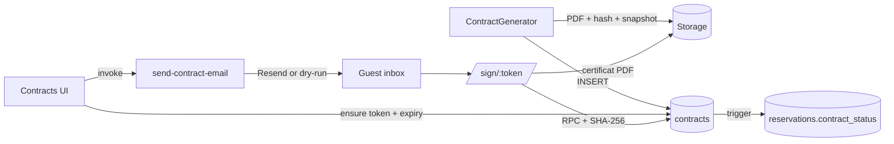

# Audit — Module Contrats (My Butlr)

**Date :** 2026-07-13 (mise à jour roadmap complète)  
**Périmètre :** registre `/app/contracts`, générateur `/app/contracts/generate`, signature `/sign/:token`, Edge Function e-mail, schémas & RLS  
**Verdict :** boucle generate → store → email/lien → sign → certificat amorcée (~8.5/10). Reste : brancher `RESEND_API_KEY` en prod + appliquer migrations 7.3/7.4.

---

## 1. Architecture



---

## 2. Livré

### P0
- [x] Persister le contrat généré + `document_url`
- [x] Edge Function `send-contract-email` (Resend, dry-run si pas de clé)
- [x] Snapshot / certificat PDF post-signature + `document_hash` / `signature_hash`
- [x] Sync `reservations.contract_status` (trigger `trg_sync_reservation_contract_status`)

### P1
- [x] `article.kind` (`stay|payment|deposit|checkinout|generic`) + fallback numéros legacy
- [x] `template_version` + `template_snapshot` figés à la création
- [x] Accents FR dans le gabarit par défaut
- [x] `signing_expires_at` (14 j) + révocation (`revoke_contract_signing_token`)
- [x] RLS `contract_templates` scoped `user_id = auth.uid()`

### P2
- [x] Drag-and-drop articles (`@dnd-kit`)
- [x] Pré-remplir surface / chambres depuis la propriété
- [x] Aperçu PDF (blob URL)
- [x] E2E smoke renforcé

---

## 3. Déploiement

1. Appliquer `supabase/migration_phase7_3_contract_schema_alignment.sql`
2. Appliquer `supabase/migration_phase7_4_contract_legal_loop.sql`
3. Déployer Edge Function :
   ```bash
   supabase functions deploy send-contract-email
   supabase secrets set RESEND_API_KEY=re_xxx CONTRACT_FROM_EMAIL="My Butlr <contracts@mybutlr.com>" APP_ORIGIN=https://votre-domaine
   ```
4. Vérifier bucket Storage `images` autorise upload `contracts/**`

---

## 4. Matrice

| Capacité | État |
|---|---|
| Générer PDF FR | ✅ |
| Enregistrer + hash + snapshot template | ✅ |
| Document consultable à la signature | ✅ |
| E-signature token + expiry + révocation | ✅ |
| E-mail (Resend) | ✅ code / ⚙️ secret requis |
| Certificat PDF signé | ✅ |
| Sync reservation.contract_status | ✅ |
| RLS templates | ✅ |
| RLS contracts multi-tenant | ✅ (phase 1.2 déjà) |

**Score : ~8.5/10** une fois migrations + secret Resend appliqués.
