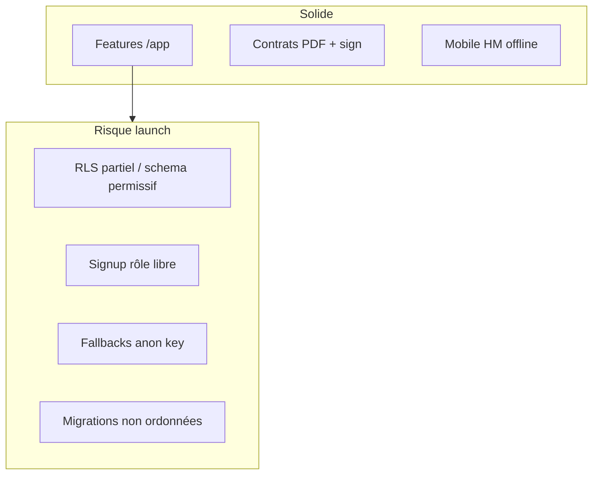

# Audit produit — My Butlr

**Date :** 2026-07-13  
**Périmètre :** plateforme entière (focus `/app`, auth, RLS, ops)  
**Audits liés :** [`audit-contrats.md`](./audit-contrats.md) · [`audit-mobile.md`](./audit-mobile.md) (branche mobile)  
**Verdict :** SaaS opérationnel riche (~40 routes staff) mais **pas prêt multi-tenant payant**. Score global **5.5/10**.

---

## 1. Synthèse

My Butlr couvre déjà un périmètre rare pour un MVP (tasks, inspections, maintenance, APA, contrats PDF, 3 shells mobiles). Le goulot n’est plus la feature surface : c’est la **posture sécurité / déploiement** (RLS, signup, secrets client, migrations non documentées).

| Domaine | Score | Note |
|---|---|---|
| Features `/app` | 7.5/10 | Large couverture CRUD live |
| Contrats | 8.5/10 | Voir audit dédié |
| Mobile HM | 8/10 | Voir audit dédié |
| Mobile Guest/Partner | 5/10 | Stubs + i18n |
| Auth / RLS | 3.5/10 | Bloquant prod |
| Tests | 4/10 | Vitest OK, e2e mince, pas de CI |
| Ops / docs | 3/10 | README ≠ migrations réelles |
| i18n | 5/10 | Parité fr/en ; 11 pages staff EN |

---

## 2. Findings (sévérité)

### Critique
1. **`schema.sql` RLS permissif** — `USING (true)` sur tables core ; README ne demande que ce fichier → risque fuite cross-tenant.
2. **Fallbacks Supabase URL + anon key hardcodés** — `src/lib/supabase.ts` (rotation clé recommandée).
3. **Signup avec sélection de rôle** — `Signup.tsx` + `handle_new_user` lit `raw_user_meta_data.role` → auto-promotion `owner` / staff.
4. **UPDATE `profiles.role` non protégé** — policy UPDATE = own row sans restriction colonne.

### Haute
5. Tables encore ouvertes après phase 1.2 : `services`, `property_images`, `checkins`, `guides`, amenities/rooms.
6. `Settings` Team : `auth.admin.inviteUserByEmail` côté client — impossible / dangereux.
7. Agency : UI full access (`useRoleFilter`) vs RLS `is_app_owner()` (owner only).
8. Storage `chat-attachments` public read.
9. `rls-audit.md` / `rls-production-policies.sql` obsolètes / trompeurs.

### Moyenne
10. `useSupabase.ts` ~2 080 L / ~50 hooks — dette + perf (`select('*')`).
11. i18n morte (`src/i18n/index.ts`) + 11 pages `/app` sans `t()`.
12. Search / Dashboard : scans full-table côté client.
13. README design « monochrome » faux (violet / gold / amber).
14. Pas de CI GitHub Actions.

### Basse
15. AI mock présenté comme insight.
16. PropertyDetail onglets Services/Documents stub.
17. Index FK manquants (`reservations.property_id`, etc.).

---

## 3. Matrice `/app` (condensée)

| Zone | État |
|---|---|
| Dashboard, Properties, Reservations, Tasks, Payments | ✅ |
| Invoices + générateur, Contracts + générateur | ✅ |
| Messages, Notifications (realtime) | ⚙️ UI EN |
| Calendar, Partners, APA, Reports | ✅ |
| Incidents, Work orders, Maintenance, Inventory, Expenses, Budgets, Inspections, Activity | ✅ |
| Settings Team / invite | ❌ cassé |
| Guest/Concierge portal (preview staff) | ⚙️ |
| Onboarding | ✅ |

---

## 4. Correctifs livrés dans cette PR

| Fix | Fichier |
|---|---|
| Audit documenté | `docs/audit-produit.md` |
| Playbook migrations | `docs/MIGRATIONS.md` |
| README : migrations + design + sécurité | `README.md` |
| Plus de fallbacks secrets client | `src/lib/supabase.ts` |
| Signup forcé `owner` (pas de self-role) | `Signup.tsx`, `authContext` |
| Trigger : role signup whitelist + role update blocked | `migration_phase11_1_auth_hardening.sql` + `schema.sql` |
| RLS résiduel services / images / checkins / guides | même migration |
| Note d’obsolescence | `supabase/rls-audit.md` |

---

## 5. Roadmap restante

### P0 (hors PR ou ops)
- Appliquer **toutes** les migrations (voir `MIGRATIONS.md`)
- Rotater la clé anon si déjà exposée
- Déployer Edge invite team (remplacer admin API client)
- Aligner agency (`is_app_principal` ou restreindre UI)
- Bucket chat privé + signed URLs

### P1
- Découper `useSupabase.ts`
- i18n pages restantes
- E2E multi-user RLS + payments
- Archiver `rls-production-policies.sql`
- KPI SQL / index FK

### P2
- CI vitest+playwright
- Unifier tokens mobile
- AI réelle ou retirer badge

---

## 6. Priorité absolue

**Sécurité + discipline migrations avant tout lancement payant.**  
Les features sont largement là ; la confiance multi-tenant ne l’est pas encore.
